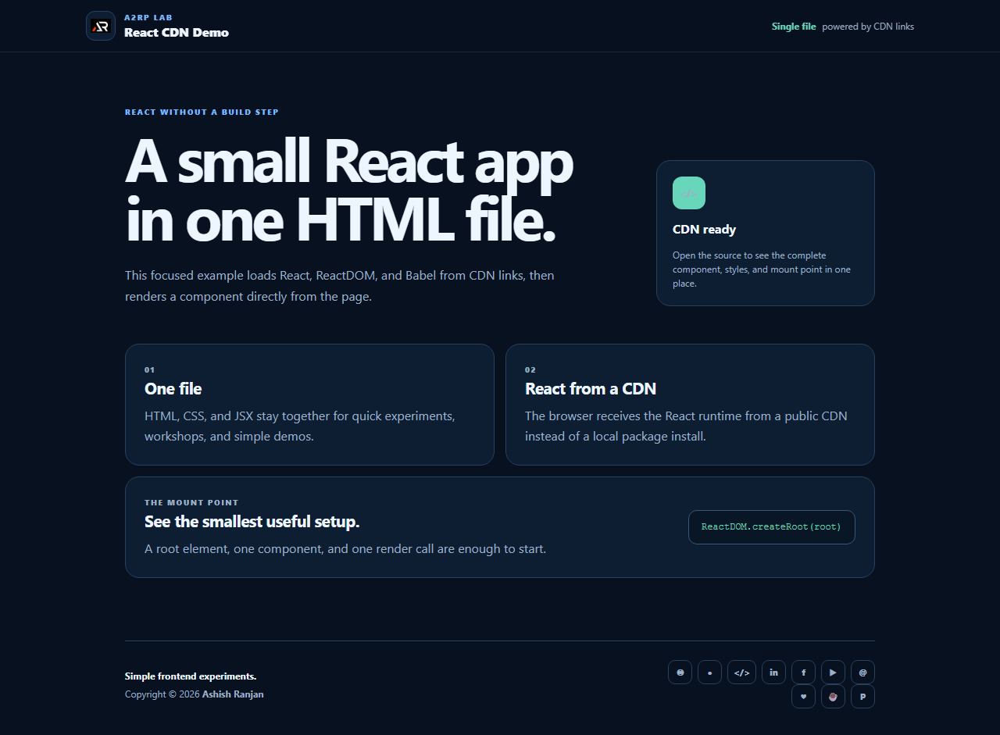

# Single File React CDN Demo

A small React presentation that runs from one HTML file. React, ReactDOM, and Babel are loaded through CDN links, so the demo needs no local build setup.

## Features

- Single-file HTML, CSS, and JSX setup
- React 18 loaded from CDN links
- Responsive fixed branded header, icon-only footer, and floating scroll-to-top control
- Accessible external links and dynamic copyright year

## Tech stack

- HTML, CSS, JSX, React, ReactDOM, and Babel CDN

## Run locally

Open `index.html` directly in a browser or use any static local server.

## Deployment

Live app: [https://a2rp.github.io/single_file_app_cdn_links/](https://a2rp.github.io/single_file_app_cdn_links/)

## Links

- Portfolio: [https://www.ashishranjan.net/](https://www.ashishranjan.net/)
- GitHub: [https://github.com/a2rp](https://github.com/a2rp)
- CodePen: [https://codepen.io/ash1198](https://codepen.io/ash1198)
- LinkedIn: [https://www.linkedin.com/in/aashishranjan](https://www.linkedin.com/in/aashishranjan)
- Facebook: [https://www.facebook.com/theash.ashish/](https://www.facebook.com/theash.ashish/)
- YouTube: [https://www.youtube.com/@ashishranjan-ashz?sub_confirmation=1](https://www.youtube.com/@ashishranjan-ashz?sub_confirmation=1)
- Email: [ash.ranjan09@gmail.com](mailto:ash.ranjan09@gmail.com)

## Support

- Support: [https://a2rp-donation-page.netlify.app/](https://a2rp-donation-page.netlify.app/)
- Buy Me a Coffee: [https://buymeacoffee.com/a2rp](https://buymeacoffee.com/a2rp)
- Patreon: [https://patreon.com/a2rp](https://patreon.com/a2rp)